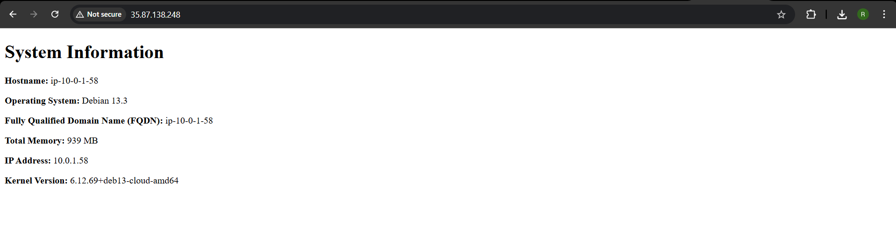

## ACIT4640 Lab Week 7

#### Install the following:
```bash 
sudo apt install ansible
``` 

```bash
sudo apt install yamllint
```

## 1. Generate a new ssh key pair
Create a key pair:
```bash 
ssh-keygen -t ed25519 -f ~/.ssh/aws
```

Import the new public to the AWS account using the `import_lab_key` script using the following command:
```bash
./scripts/import_lab_key ~/.ssh/aws.pub
```

## 2. Run terraform configuration
cd into your terraform directory and run:
`terraform init` # Initialize provider plugins

`terraform fmt` # Format configuration

`terraform validate` # Validate syntax

`terraform plan` # Preview changes

`terraform apply` # Deploy infrastructure

After running terraform apply, two ec2 instances will be created with the DNS names and Public IP addresses. Either the DNS names or Public IP addresses can be added to the `hosts.yaml` file.

## 3. Completing the playbook.yaml file
After completing the playbook.yaml file, we need to run:
```bash
ansible-playbook --syntax-check playbook.yml
```
to check for any errors, if there are no errors, then we run:

```bash
ansible-playbook playbook.yml
```

Once all the tasks were successfully completed, we will be able to visit the webserver by the Public IP address:


## Teardown
CD into the terraform directory and run:
```bash
terraform destroy
```

then cd into the scripts directory and run the `delete_lab_key` script
```bash
./delete_lab_key
```


